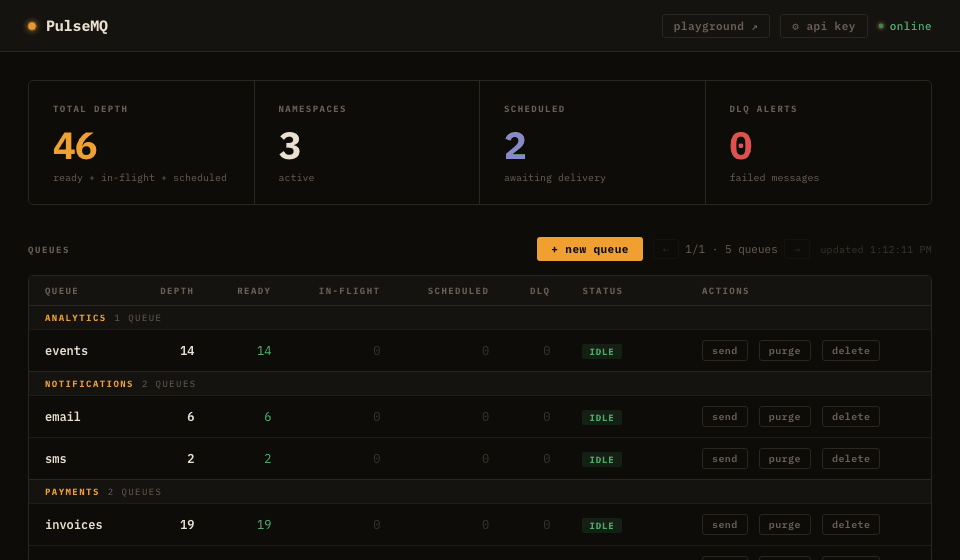
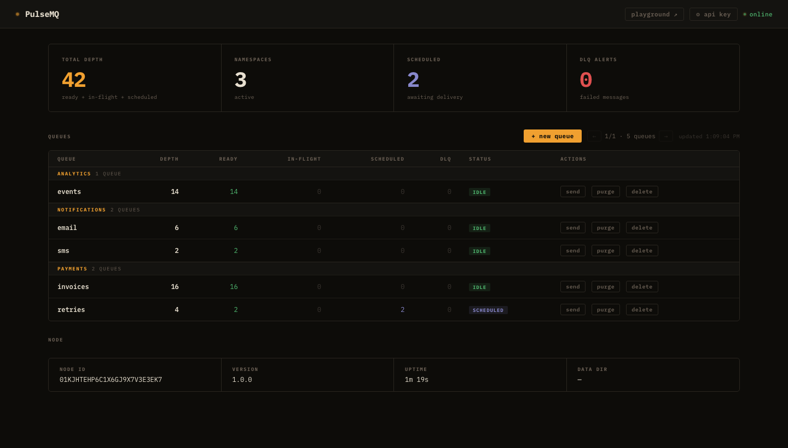

# PulseMQ

> **Send it now. Send it later. One queue.**

Durable message queue with native scheduled delivery. Self-hosted. Zero dependencies.

[](https://golang.org)
[](LICENSE)
[](https://hub.docker.com/r/pulsemq/pulsemq)
[](https://hub.docker.com/r/pulsemq/pulsemq)
[](https://hub.docker.com/r/pulsemq/pulsemq)
[](https://sneh-joshi.github.io/pulsemq)



---

## Why PulseMQ?

| Problem | Old Way | With PulseMQ |
|---|---|---|
| Send email 1 hr after signup | Cron job + DB polling | `Publish(body, WithDelay(time.Hour))` |
| Retry failed payment after 24 hr | Scheduler service | `Publish(body, WithDelay(24*time.Hour))` |
| Cancel unpaid order in 30 min | DB scan every minute | `Publish(body, WithDeliverAt(orderTime+30min))` |
| Publish blog post at 9 am | Cron + CMS flag | `Publish(body, WithDeliverAt(monday9am))` |

**Key differentiator:** Native scheduled delivery via an in-memory Min-Heap — O(1) peek, O(log N) insert, no polling.

---

## Features

- **Scheduled delivery** — `deliverAt` in any future UTC millisecond, up to 90 days ahead
- **Three consumer models** — HTTP poll, WebSocket push, Webhook push
- **Dead-letter queue** — automatic DLQ per queue, manual replay via API
- **Durable storage** — append-only WAL + bbolt index; WAL is replayed on restart to restore all state. Default `fsync=interval` (1 s flush) — use `fsync=always` for zero data loss on hard crash
- **Visibility timeout + ACK** — at-least-once, exactly-once-friendly delivery
- **Namespaces** — logical grouping, auto-created on first use
- **Auth** — static API key (`X-Api-Key` header)
- **Prometheus metrics** — `/metrics` endpoint on port 9090
- **Built-in dashboard** — `/dashboard` with live queue depths


- **Single binary** — no runtime dependencies, ~8 MB Docker image
- **Go SDK** — idiomatic client for producers and consumers

---

## Current Status

| Area | Status |
|---|---|
| Deployment | Single-node only — 3-node Raft cluster support is on the roadmap |
| Language SDKs | Go SDK; all other languages use the HTTP/WebSocket API directly |
| Auth | Static API key (`X-Api-Key`); key rotation requires a server restart |

---

## Alternatives

| Capability | PulseMQ | Redis + BullMQ | Sidekiq | Temporal |
|---|---|---|---|---|
| ms-precision scheduled delivery | ✅ first-class | ⚠️ polling | ⚠️ polling | ✅ workflow timers |
| Self-hostable, single binary | ✅ ~8 MB, zero deps | ⚠️ requires Redis | ⚠️ Redis + Ruby | ⚠️ multi-service |
| Clustering | ❌ v1 single-node | ✅ Redis Cluster | ✅ via Redis | ✅ built-in |
| Language support | Any (HTTP/WS) + Go SDK | JS / TS | Ruby | Many |
| Dead-letter queue | ✅ built-in | ✅ | ✅ | ✅ |
| Operational complexity | Low | Medium | Medium | High |
| Primary use case | Scheduled & delayed jobs | General tasks (Node) | Background jobs (Ruby) | Stateful workflows |

> PulseMQ is purpose-built for scheduled and delayed job delivery with minimal operational overhead. For complex multi-step orchestration, Temporal may be a better fit.

---

## AI agent workflows

`deliver_at` + DLQ makes PulseMQ a natural fit for AI pipelines:

**Agent task scheduling** — User asks an agent to "follow up in 3 days"? Publish with `deliver_at = now + 3 days`. Fires exactly when due, no polling loop.

**LLM rate limit handling** — Hit a 429? Publish the request with `deliver_at = now + retry_after_ms`. Consumer picks it up when the window resets. No sleep loops, no lost requests.

**Async AI pipelines** — User submits → publish job → return ID immediately. Worker calls LLM, stores result. If it crashes mid-task, visibility timeout requeues automatically.

**Human-in-the-loop** — Agent proposes action → publish to `pending_approval` queue. Human approves → ACK, next step fires. No response → DLQ triggers auto-decline path.

```python
import time, base64, requests

BASE = "http://localhost:8080"

# Agent schedules a follow-up 3 days from now
deliver_at = int(time.time() * 1000) + (3 * 24 * 3600 * 1000)

requests.post(
    f"{BASE}/namespaces/agents/queues/followups/messages",
    json={
        "body": base64.b64encode(b"email_followup:lead_id:123").decode(),
        "deliver_at": deliver_at,
    }
)
# Message fires in exactly 3 days. No cron. No polling. No extra service.
```

---


### Docker Compose (recommended)

```bash
git clone https://github.com/sneh-joshi/pulsemq
cd pulsemq/docker
docker compose up -d
```

Open your browser at http://localhost:8080/dashboard.

### Binary

```bash
go build -o pulsemq ./cmd/server
./pulsemq --config config.yaml
```

### Docker (single container)

```bash
docker run -p 8080:8080 -p 9090:9090 \
  -v $(pwd)/data:/data \
  pulsemq/pulsemq:latest
```

Image is published on Docker Hub: [`pulsemq/pulsemq`](https://hub.docker.com/r/pulsemq/pulsemq) — supports `linux/amd64` and `linux/arm64`.

---

## HTTP API — 30 second tour

```bash
BASE=http://localhost:8080

# Publish immediately
curl -s -X POST $BASE/namespaces/payments/queues/invoices/messages \
  -H "Content-Type: application/json" \
  -d '{"body":"eyJhbW91bnQiOjQyfQ=="}'   # base64("{"amount":42}")

# Publish in 1 hour (deliverAt = now + 3600000 ms)
curl -s -X POST $BASE/namespaces/payments/queues/invoices/messages \
  -H "Content-Type: application/json" \
  -d "{\"body\":\"eyJhbW91bnQiOjk5fQ==\", \"deliver_at\":$(( $(date +%s%3N) + 3600000 ))}"

# Consume (poll up to 10 messages)
curl -s "$BASE/namespaces/payments/queues/invoices/messages?n=10"

# ACK
curl -s -X DELETE "$BASE/messages/<receipt_handle>"

# NACK (requeue)
curl -s -X POST "$BASE/messages/<receipt_handle>/nack"
```

---

## Go SDK

```go
import "github.com/sneh-joshi/pulsemq/pkg/client"

c := client.New("http://localhost:8080",
    client.WithAPIKey("your-secret"),  // omit when auth is disabled
)

// Publish immediately
id, err := c.Publish(ctx, "payments", "invoices", []byte(`{"amount":42}`))

// Schedule in 1 hour
id, err = c.Publish(ctx, "payments", "invoices", payload,
    client.WithDelay(time.Hour),
)

// Schedule at an absolute time
id, err = c.Publish(ctx, "payments", "invoices", payload,
    client.WithDeliverAt(time.Date(2026, 3, 1, 9, 0, 0, 0, time.UTC)),
)

// Batch publish
ids, err := c.PublishBatch(ctx, "payments", "invoices", [][]byte{body1, body2})

// Consume
msgs, err := c.Consume(ctx, "payments", "invoices", 10,
    client.WithVisibilityTimeout(60*time.Second),
)
for _, m := range msgs {
    if err := process(m.Body); err != nil {
        _ = c.Nack(ctx, m.ReceiptHandle) // requeue
        continue
    }
    _ = c.Ack(ctx, m.ReceiptHandle)
}

// DLQ operations
dlqMsgs, _ := c.DrainDLQ(ctx, "payments", "invoices", 100)
replayed, _ := c.ReplayDLQ(ctx, "payments", "invoices", 100)

// Webhook subscription
subID, _ := c.Subscribe(ctx, "payments", "invoices", "https://myapp.com/hook", "hmac-secret")
_ = c.Unsubscribe(ctx, subID)

// Namespace management
_ = c.CreateNamespace(ctx, "analytics")
nsList, _ := c.ListNamespaces(ctx)
_ = c.DeleteNamespace(ctx, "analytics")

// Observability
health, _ := c.Health(ctx)   // status, nodeID, uptime, version
stats, _ := c.Stats(ctx)     // per-queue ready/in-flight/dlq depths
```

### Consumer poll loop pattern

```go
ticker := time.NewTicker(500 * time.Millisecond)
defer ticker.Stop()

for range ticker.C {
    msgs, err := c.Consume(ctx, "payments", "invoices", 10)
    if err != nil {
        log.Println("consume error:", err)
        continue
    }
    for _, m := range msgs {
        if err := handle(m); err != nil {
            _ = c.Nack(ctx, m.ReceiptHandle)
        } else {
            _ = c.Ack(ctx, m.ReceiptHandle)
        }
    }
}
```

---

## Configuration

```yaml
# config.yaml (minimal)
node:
  host: "0.0.0.0"
  port: 8080
  data_dir: "./data"

auth:
  enabled: false        # set to true + api_key to require X-Api-Key
  api_key: ""

metrics:
  enabled: true
  port: 9090            # Prometheus scrape target: http://host:9090/metrics

queue:
  default_visibility_timeout_ms: 30000
  max_retries: 5
  max_messages: 100000
```

See [config.yaml](config.yaml) for the full reference with all defaults.

---

## Observability

| Endpoint | Description |
|---|---|
| `GET /health` | JSON status, node ID, queue count, uptime, version |
| `GET /metrics` | Prometheus text (also available on port 9090) |
| `GET /dashboard` | Live browser dashboard |
| `GET /api/stats` | JSON queue depths (used by dashboard) |

### Prometheus metrics

```
pulsemq_messages_published_total{namespace,queue}
pulsemq_messages_consumed_total{namespace,queue}
pulsemq_messages_acked_total{namespace,queue}
pulsemq_messages_nacked_total{namespace,queue}
pulsemq_messages_dlq_routed_total{namespace,queue}
pulsemq_http_requests_total{method,path,status}
pulsemq_http_request_duration_milliseconds_sum{method,path}
pulsemq_http_request_duration_milliseconds_count{method,path}
```

---

## Performance (single node, estimated)

Numbers below are for a Linux VPS (2–4 vCPU, shared SSD). Docker Desktop (macOS/Windows) is lower due to VM overhead — expect ~4,000 msgs/sec write and ~2,000 msgs/sec read.

| Metric | Linux VPS (est.) |
|---|---|
| Write throughput (fsync=interval) | ~15,000 msgs/sec |
| Write throughput (fsync=never) | ~80,000 msgs/sec |
| Read throughput | ~30,000 msgs/sec |
| Scheduled message heap | 1M entries ≈ ~100 MB RAM |
| Min-heap peek latency | O(1) |
| Delivery accuracy | ±15–30 ms |

---

## Architecture overview

```
Producer → HTTP POST → Broker.Publish → queue.Manager → StorageEngine (WAL+Log+Index)
                                           ↓
                                    Scheduler (Min-Heap)
                                           ↓ deliverAt reached
Consumer ← HTTP GET  ← Broker.Consume ← queue.Queue.DequeueN
Consumer → DELETE    → Broker.Ack     → queue.Queue.Ack
Consumer → POST/nack → Broker.Nack    → queue.Queue.Nack → DLQ (if maxRetries hit)
```

See [docs/architecture.md](docs/architecture.md) for the full design.

---

## Project structure

```
pulsemq/
├── cmd/server/          — server entry point
├── pkg/client/          — public Go SDK
├── internal/
│   ├── broker/          — central orchestrator
│   ├── queue/           — state machine, manager, message
│   ├── scheduler/       — min-heap timer goroutine
│   ├── storage/local/   — WAL, append log, bbolt index, compaction
│   ├── dlq/             — dead-letter queue manager
│   ├── namespace/       — namespace registry (JSON persistence)
│   ├── metrics/         — Prometheus text exporter (no client_golang)
│   ├── consumer/        — webhook delivery + manager
│   ├── config/          — YAML config loader + validation
│   ├── node/            — ULID node identity
│   └── transport/       — HTTP + WebSocket handlers
├── dashboard/           — dashboard HTML (served at /dashboard)
├── docker/              — Dockerfile + docker-compose.yml
├── docs/                — architecture, API reference, getting started
└── config.yaml          — default configuration
```

---

## Contributing

Contributions are welcome! Please read [CONTRIBUTING.md](CONTRIBUTING.md) before opening a PR.

```bash
go test ./... -count=1 -timeout 90s   # run all tests
go build ./...                         # verify compilation
```

Please follow our [Code of Conduct](CODE_OF_CONDUCT.md). For security issues, see [SECURITY.md](SECURITY.md).

---

## License

MIT — see [LICENSE](LICENSE).
